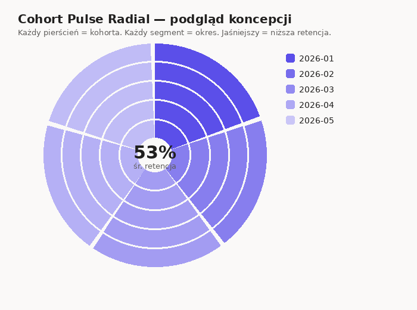

# Cohort Pulse Radial

Autorska custom visual do Power BI — radialna wizualizacja retencji kohort. Zamiast klasycznej tabeli/heatmapy kohort (wiersze = kohorty, kolumny = okresy), każda kohorta jest osobnym **pierścieniem**, a spadek retencji w kolejnych okresach jest widoczny jako **gasnący gradient** od centrum ku obwodowi — stąd nazwa "pulse" (puls).



## Dlaczego taki format

Tabele/heatmapy kohort dominują w bibliotekach Power BI (natywny "Table", niestandardowe "Cohort Chart" z AppSource). Format radialny w praktyce nie występuje w popularnych galeriach custom visuali, a jednocześnie:

- **Wzorzec spadku jest odczytywany od razu z geometrii** (gasnący kolor od środka), a nie z odczytywania liczb w tabeli.
- **Środek wykresu jest "wolnym miejscem"** wykorzystanym pod zagregowaną metrykę podsumowującą (np. średnia retencja, LTV) — czego tabela nie ma.
- **Skaluje się dobrze do wielu kohort** — kolejne miesiące/tygodnie to kolejne pierścienie, bez rozrastania się w jednym wymiarze jak w tabeli.

Zastosowania: analiza retencji użytkowników/graczy, LTV po kohortach akwizycji, cykl życia klienta, dowolna metryka opadająca w czasie od "dnia 0".

## Struktura projektu

```
pbi-custom-visual/
├── pbiviz.json                 # metadane wizualizacji (nazwa, guid, wersja, ikona)
├── capabilities.json           # role danych, dataViewMappings, obiekty formatowania
├── package.json                 # zależności (d3, powerbi-visuals-api, formattingmodel utils)
├── tsconfig.json                 # konfiguracja kompilatora TypeScript
├── src/
│   ├── visual.ts                # logika renderowania D3 (klasa Visual implements IVisual)
│   └── settings.ts               # formatting model (karty: kolory, layout, centrum, etykiety, legenda)
├── style/
│   └── visual.less               # style CSS/LESS wizualizacji
├── assets/
│   └── icon.png                   # ikona 100x100 do panelu wizualizacji
├── testData/
│   └── sample-retention-data.csv  # przykładowe dane testowe (5 kohort x 5 okresów)
└── preview/
    ├── preview.html                # żywy podgląd D3 w przeglądarce (poza pakietem pbiviz)
    └── render_preview.py            # skrypt generujący statyczny podgląd PNG
```

## Model danych (role)

| Rola | Typ | Opis |
|---|---|---|
| `cohort` | Grouping | Identyfikator kohorty, np. miesiąc akwizycji (`2026-01`, `2026-02`...) — jeden pierścień na wartość |
| `period` | Grouping | Numer okresu od akwizycji (0, 1, 2, 3...) — jeden segment łuku na wartość |
| `retention` | Measure | Wartość metryki: % retencji, LTV, ARPU itp. — determinuje intensywność koloru segmentu |
| `tooltipData` | Measure | Opcjonalne dodatkowe metryki widoczne w tooltipie po najechaniu |

Przykładowe dane testowe: `testData/sample-retention-data.csv`.

## Panel formatowania (formatting model)

Zaimplementowany przez `powerbi-visuals-utils-formattingmodel` (aktualny standard, zamiast przestarzałego `objectEnumeration`):

- **Kolory danych** — kolor bazowy oraz typ skali (sekwencyjna / rozbieżna / monochromatyczna)
- **Układ pierścieni** — promień wewnętrzny (%), odstęp między pierścieniami, kąt startowy, zasięg (sweep) — pozwala przejść z pełnego okręgu na "wachlarz" np. 270°
- **Metryka centralna** — włącz/wyłącz, etykieta, rozmiar i kolor czcionki
- **Etykiety danych** — wartości liczbowe na segmentach
- **Legenda** — mapowanie kolor → nazwa kohorty, pozycja, rozmiar czcionki

## Budowanie projektu

Wymagania: Node.js ≥ 18, `powerbi-visuals-tools` (`pbiviz`).

```bash
npm install -g powerbi-visuals-tools
cd pbi-custom-visual
npm install
pbiviz start        # live reload w Power BI Desktop / Service (developer visual)
pbiviz package       # generuje plik .pbiviz w katalogu dist/
```

Zaimportuj wygenerowany `.pbiviz` do Power BI przez **Wizualizacje → Więcej opcji → Importuj z pliku**.

## Zgodność z dobrymi praktykami certyfikacji

- Struktura projektu i pliki (`pbiviz.json`, `capabilities.json`, `visual.ts`, `settings.ts`) zgodne z [oficjalnym SDK Microsoftu](https://learn.microsoft.com/en-us/power-bi/developer/visuals/develop-power-bi-visuals) i repozytorium [`microsoft/PowerBI-visuals-tools`](https://github.com/microsoft/powerbi-visuals-tools).
- Formatting model przez `powerbi-visuals-utils-formattingmodel` zgodnie z [dokumentacją formatting model utils](https://learn.microsoft.com/en-us/power-bi/developer/visuals/utils-formatting-model).
- Wsparcie dla `selectionManager` (cross-filtering/highlight) i `tooltipServiceWrapper` (natywne tooltipy Power BI).
- `apiVersion` ustawione na aktualną wersję `5.11.0`.

## Autor

Łukasz Sz — Power BI developer / data engineer, doświadczenie w budowie metryk retencji, LTV i wskaźników wzrostowych (Power BI, DAX, Power Query, Microsoft Fabric).
